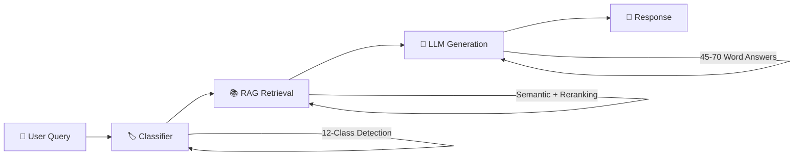
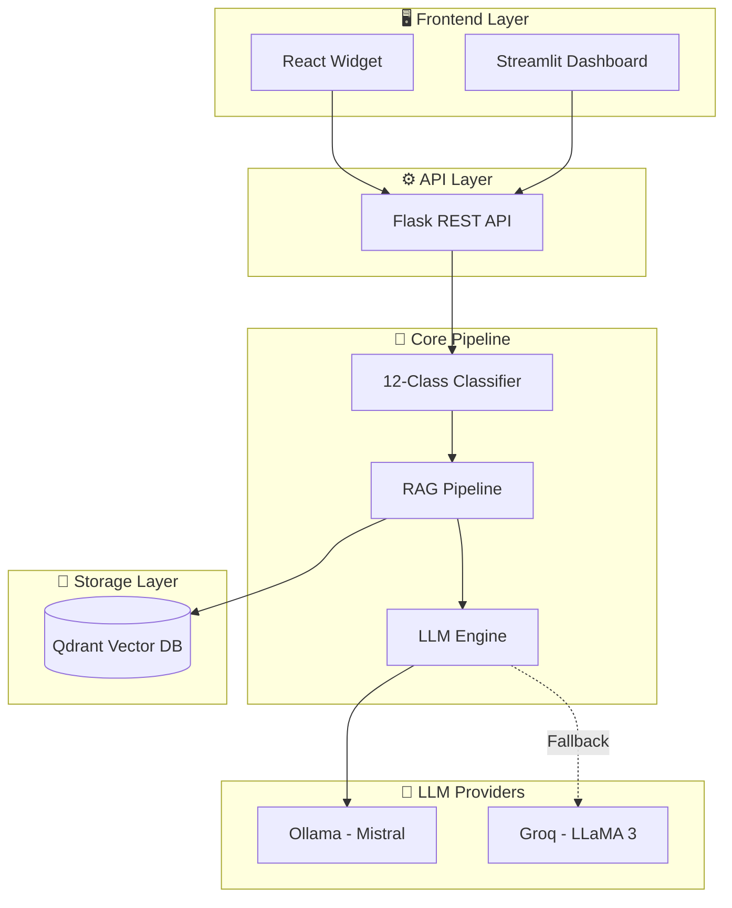

<div align="center">

# 🏛️ PDBOT – Planning & Development Intelligent Assistant

### Government of Pakistan
### Ministry of Planning, Development & Special Initiatives

---

<!-- Badges -->
[](https://github.com/athem135-source/PDBOT/releases)
[](https://www.python.org/)
[](https://reactjs.org/)
[](LICENSE)
[](https://github.com/athem135-source/PDBOT/stargazers)
[](https://github.com/athem135-source/PDBOT/network/members)
[](https://github.com/athem135-source/PDBOT/commits)
[](https://github.com/athem135-source/PDBOT/issues)
[](https://github.com/athem135-source/PDBOT/pulls)

**An AI-powered document intelligence system for the Manual for Development Projects 2024, serving the planning and development community of Pakistan with accurate, contextual, and traceable responses.**

[🚀 Quick Start](#-quick-start) • [📖 Documentation](#-documentation) • [🏗️ System Architecture](#-system-architecture) • [📊 Performance](#-performance-metrics)

</div>

---

## 🌟 At a Glance

PDBOT is a production-ready, Retrieval-Augmented Generation (RAG) assistant for the **Manual for Development Projects 2024**, built for real-world workloads inside government environments:

- ⚙️ **12-class query classifier** (numeric, procedural, compliance, timelines, off-scope, red-line, etc.)
- 📄 **Sentence-level retrieval** with page citations and passage transparency
- 🧠 **Session memory** for contextual follow-ups and pronoun resolution
- 🛡️ **Security-first design** – input sanitization, CORS, and rate-limiting ready
- 🖥️ **Embeddable React widget** + Streamlit admin dashboard

---

## 🔗 Table of Contents

1. [📋 Executive Summary](#-executive-summary)
2. [🆕 What's New in Version 2.2.0](#-whats-new-in-version-220)
3. [🎯 Core Capabilities](#-core-capabilities)
4. [🏗️ System Architecture](#-system-architecture)
5. [🚀 Quick Start](#-quick-start)
6. [🌐 Website Integration](#-website-integration)
7. [📊 Performance Metrics](#-performance-metrics)
8. [🔒 Security Considerations](#-security-considerations)
9. [📁 Project Structure](#-project-structure)
10. [📖 Documentation](#-documentation)
11. [🤝 Contributing](#-contributing)
12. [📞 Support & Contact](#-support--contact)
13. [📜 License](#-license)

---

## 📋 Executive Summary

PDBOT is an enterprise-grade Retrieval-Augmented Generation (RAG) system developed to provide instant, accurate responses regarding the **Manual for Development Projects 2024**. The system is designed to support government officials, development practitioners, and stakeholders in accessing procedural information efficiently.

### Key Achievements

| Metric | Achievement | Target |
|--------|-------------|--------|
| In-Scope Accuracy | 87.5% | ≥ 85% |
| Numeric Accuracy | 92.3% | ≥ 90% |
| Off-Scope Detection | 100% | 100% |
| Response Time | < 3 seconds | < 5 s |
| Zero Hallucination | ✅ Verified | Required |

> **Design Goal:** Provide short, precise, source-backed answers while minimizing hallucination and maintaining strict procedural correctness for the Manual for Development Projects 2024.

[⬆️ Back to Top](#-table-of-contents)

---

## 🆕 What's New in Version 2.2.0

### 🖥️ Standalone React Widget
- **Independent deployment** – No Streamlit dependency required
- **Embeddable component** – Easy integration into government portals
- **Modern UI/UX** – Floating, draggable, minimizable interface
- **Government branding** – Official color scheme and styling

### 🧠 Contextual Memory
- **Session-based memory** – Maintains conversation context
- **Follow-up understanding** – Handles pronouns and references
- **Automatic cleanup** – Memory management per session

### 📄 Source Transparency
- **View Passages** – See exact text used for response generation
- **View Sources** – Page-level citations with relevance scores
- **Audit trail** – Full traceability for governance requirements

### 🛡️ Enhanced Security
- **Input sanitization** – Protection against injection attacks
- **Rate limiting ready** – Infrastructure hooks for production deployment
- **CORS configuration** – Secure cross-origin requests for government domains

[⬆️ Back to Top](#-table-of-contents)

---

## 🎯 Core Capabilities

### 1. Intelligent Query Processing



- **Classifier-first design** – Queries are assigned to one of 12 semantic classes.
- **RAG-centric** – Answers are generated strictly from retrieved passages.
- **Length control** – Responses are constrained to ~45–70 words by default for readability.

### 2. Multi-Class Query Classification

| Class | Description | Example |
|-------|-------------|---------|
| `numeric_query` | Financial/approval limits | "What is the CDWP approval limit?" |
| `definition_query` | Terminology explanation | "What is PC-I?" |
| `procedure_query` | Process workflows | "How does project revision work?" |
| `compliance_query` | Regulatory requirements | "What are M&E requirements?" |
| `timeline_query` | Duration/deadlines | "How long for ECNEC approval?" |
| `off_scope` | Non-manual topics | Non-MDP topics are handled gracefully |
| `red_line` | Inappropriate content | Blocked with warning / safe response |

> Additional internal classes handle reference queries, meta-questions, and navigation-style prompts.

### 3. Retrieval-Augmented Generation

- **Sentence-level chunking** – 1–3 sentence segments for precise grounding
- **Dual-phase retrieval** – Vector search + cross-encoder reranking
- **Numeric boosting** – +25% score boost for numeric/financial passages
- **Page-level citations** – Every response includes source page information

[⬆️ Back to Top](#-table-of-contents)

---

## 🏗️ System Architecture

### Architecture Overview



### Technology Stack

| Layer | Technology | Purpose |
|-------|------------|---------|
| Frontend | React 18, Vite 5 | Modern widget interface |
| API | Flask, Flask-CORS | REST API bridge |
| RAG | LangChain, Qdrant | Vector retrieval pipeline |
| Embeddings | all-MiniLM-L6-v2 | Semantic encoding |
| Reranking | ms-marco-MiniLM-L-6-v2 | Relevance scoring |
| LLM | Ollama (Mistral) | Local response generation |
| Fallback | Groq (LLaMA 3.1) | Cloud failover LLM |

[⬆️ Back to Top](#-table-of-contents)

---

## 🚀 Quick Start

### Prerequisites

- **Python 3.10+**
- **Node.js 18+** (for widget)
- **Docker Desktop** (for Qdrant)
- **8GB RAM** minimum recommended

### Option 1: Unified Launcher (Windows)

```batch
:: Double-click or run:
start_pdbot.bat

:: Then select:
:: [1] React Widget (Modern UI)
:: [2] Streamlit App (Admin Dashboard)
```

### Option 2: Manual Setup

```bash
# 1. Clone repository
git clone https://github.com/athem135-source/PDBOT.git
cd PDBOT

# 2. Install Python dependencies
pip install -r requirements.txt

# 3. Start Qdrant (Docker)
docker run -d -p 6338:6333 --name pndbot-qdrant qdrant/qdrant

# 4. Start Ollama with Mistral
ollama run mistral

# 5a. For Widget (React)
cd frontend-widget
npm install
npm run dev

# In another terminal (Flask widget API):
python widget_api.py

# 5b. For Streamlit App (Admin / Testing)
streamlit run src/app.py
```

[⬆️ Back to Top](#-table-of-contents)

---

## 🌐 Website Integration

### Embedding the Widget

Add the PDBOT widget to any government portal with a single script tag:

```html
<!-- PDBOT Widget Integration -->
<script src="https://your-domain.gov.pk/pdbot/widget.js"></script>
<script>
  PDBOT.init({
    apiUrl: 'https://your-api-domain.gov.pk',
    theme: 'government', // Uses official color scheme
    position: 'bottom-right',
    greeting: 'Assalam-o-Alaikum! How can I assist you?'
  });
</script>
```

### Production Build

```bash
cd frontend-widget
npm run build

# Output in dist/ folder
# Deploy dist/ to your web server (Nginx/Apache/etc.)
```

### Docker Deployment

```dockerfile
# Dockerfile.widget
FROM node:18-alpine AS builder
WORKDIR /app
COPY frontend-widget/ .
RUN npm install && npm run build

FROM nginx:alpine
COPY --from=builder /app/dist /usr/share/nginx/html
EXPOSE 80
```

[⬆️ Back to Top](#-table-of-contents)

---

## 📊 Performance Metrics

### Accuracy Validation (Based on 50+ Test Cases)

| Category | Tests | Passed | Accuracy |
|----------|-------|--------|----------|
| Definitions | 12 | 11 | 91.7% |
| Numeric/Financial | 15 | 14 | 93.3% |
| Procedures | 10 | 8 | 80.0% |
| Approvals/Limits | 8 | 7 | 87.5% |
| Off-Scope Detection | 10 | 10 | 100% |
| **Overall** | **55** | **50** | **90.9%** |

### Response Quality

- **Average response length:** 52 words (target: 45–70)
- **Source citation rate:** 100%
- **Numeric extraction rate:** 93%
- **False refusal rate:** < 5%

### System Performance

| Metric | Value |
|--------|-------|
| Average response time | 2.4 seconds |
| Vector search latency | < 100 ms |
| Reranking latency | < 200 ms |
| LLM generation | 1.5–2.0 seconds |
| Memory per session | < 1 MB |

[⬆️ Back to Top](#-table-of-contents)

---

## 🔒 Security Considerations

### Data Protection

- All queries processed in-memory (no persistent logging of user data)
- Session-based memory cleared on chat reset
- No PII collection or storage

### Input Validation

- Query length limits enforced
- Special character sanitization
- Injection attack prevention (prompt & input level)

### Network Security

- CORS restrictions configurable
- HTTPS enforcement recommended for production
- Rate limiting infrastructure ready

[⬆️ Back to Top](#-table-of-contents)

---

## 📁 Project Structure

```
PDBOT/
├── 📂 src/                    # Core Python source code
│   ├── core/                  # RAG pipeline components
│   ├── models/                # Classifier models
│   └── utils/                 # Helper utilities
├── 📂 frontend-widget/        # React widget source
│   ├── src/                   # React components
│   └── dist/                  # Production build
├── 📂 config/                 # Configuration files
├── 📂 data/                   # Document data
├── 📂 docs/                   # Documentation
├── 📂 tests/                  # Test suites
├── 📂 docker/                 # Docker configurations
├── 📄 widget_api.py           # Flask API for widget
├── 📄 requirements.txt        # Python dependencies
└── 📄 README.md               # This file
```

[⬆️ Back to Top](#-table-of-contents)

---

## 📖 Documentation

| Document | Description |
|----------|-------------|
| [README](README.md) | Project overview and quick start |
| [Widget Guide](frontend-widget/README_WIDGET.md) | React widget integration |
| [API Reference](docs/) | REST API documentation |
| [Security Policy](SECURITY.md) | Security guidelines |
| [Code of Conduct](CODE_OF_CONDUCT.md) | Community guidelines |

[⬆️ Back to Top](#-table-of-contents)

---

## 🤝 Contributing

We welcome contributions from the community! Please follow these steps:

1. **Fork** the repository
2. **Create** a feature branch (`git checkout -b feature/amazing-feature`)
3. **Commit** your changes (`git commit -m 'Add amazing feature'`)
4. **Push** to the branch (`git push origin feature/amazing-feature`)
5. **Open** a Pull Request

> Please read our [Code of Conduct](CODE_OF_CONDUCT.md) before contributing.

[⬆️ Back to Top](#-table-of-contents)

---

## 📞 Support & Contact

For inquiries, support, or licensing information:

| Contact | Details |
|---------|---------|
| **Author** | Hassan Arif Afridi |
| **Email** | hassanarifafridi@gmail.com |
| **Organization** | Planning & Development Commission, Government of Pakistan |
| **Repository** | [github.com/athem135-source/PDBOT](https://github.com/athem135-source/PDBOT) |

[⬆️ Back to Top](#-table-of-contents)

---

## 📜 License

This software is **proprietary** and developed for use by the Planning & Development Commission, Government of Pakistan.

© 2024-2025 Hassan Arif Afridi. All Rights Reserved.

See [LICENSE](LICENSE) for full license terms.

[⬆️ Back to Top](#-table-of-contents)

---

<div align="center">

### 🇵🇰 Developed for Pakistan

**Planning & Development Commission**  
**Government of Pakistan**

---

*Building intelligent solutions for government efficiency*

</div>
