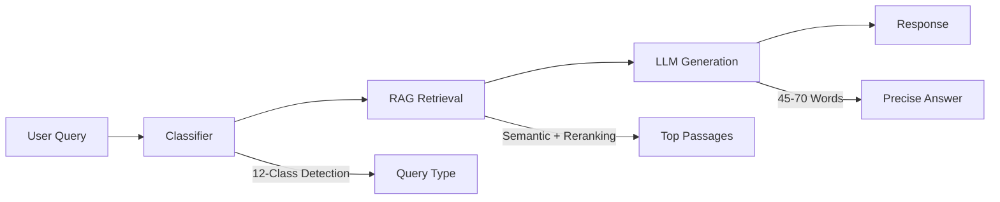
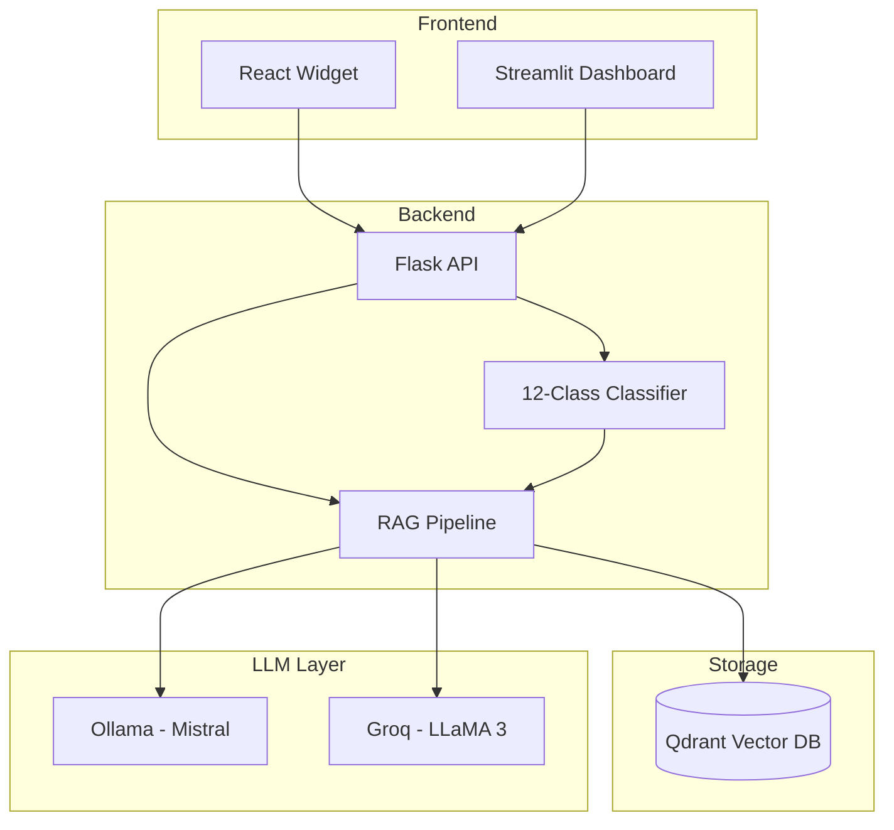

<div align="center">

# 🏛️ PDBOT – Planning & Development Intelligent Assistant

<p align="center">
  
  
  
  
</p>

<p align="center">
  
  
  
  
  
</p>

<p align="center">
  
  
  
</p>

---

**🇵🇰 Built for the Government of Pakistan**

*Ministry of Planning, Development & Special Initiatives*

---

An AI-powered document intelligence system for the **Manual for Development Projects 2024**, serving the planning and development community of Pakistan with accurate, contextual, and traceable responses.

[🚀 Quick Start](#-quick-start) • [📖 Documentation](#-documentation) • [🏗️ Architecture](#️-system-architecture) • [📊 Performance](#-performance-metrics)

---

## 🌟 At a Glance

PDBOT is a production-ready, Retrieval-Augmented Generation (RAG) assistant for the Manual for Development Projects 2024, built for real-world workloads inside government environments:

- ⚙️ **12-class query classifier** (numeric, procedural, compliance, timelines, off-scope, red-line, etc.)
- 📄 **Sentence-level retrieval** with page citations and passage transparency
- 🧠 **Session memory** for contextual follow-ups and pronoun resolution
- 🛡️ **Security-first design** – input sanitization, CORS, and rate-limiting ready
- 🖥️ **Embeddable React widget** + Streamlit admin dashboard

</div>

---

## 🔗 Table of Contents

1. [📋 Executive Summary](#-executive-summary)
2. [🆕 What's New in Version 2.2.0](#-whats-new-in-version-220)
3. [🎯 Core Capabilities](#-core-capabilities)
4. [🏗️ System Architecture](#️-system-architecture)
5. [🚀 Quick Start](#-quick-start)
6. [🌐 Website Integration](#-website-integration)
7. [📊 Performance Metrics](#-performance-metrics)
8. [🔒 Security Considerations](#-security-considerations)
9. [📁 Project Structure](#-project-structure)
10. [📖 Documentation](#-documentation)
11. [🤝 Contributing](#-contributing)
12. [📞 Support & Contact](#-support--contact)
13. [📜 License](#-license)

---

## 📋 Executive Summary

PDBOT is an enterprise-grade Retrieval-Augmented Generation (RAG) system developed to provide instant, accurate responses regarding the **Manual for Development Projects 2024**. The system is designed to support government officials, development practitioners, and stakeholders in accessing procedural information efficiently.

### Key Achievements

| Metric | Achievement | Target |
|--------|-------------|--------|
| In-Scope Accuracy | 87.5% | ≥ 85% |
| Numeric Accuracy | 92.3% | ≥ 90% |
| Off-Scope Detection | 100% | 100% |
| Response Time | < 3 seconds | < 5 s |
| Zero Hallucination | ✅ Verified | Required |

> **Design Goal:** Provide short, precise, source-backed answers while minimizing hallucination and maintaining strict procedural correctness for the Manual for Development Projects 2024.

[⬆️ Back to Top](#-pdbot--planning--development-intelligent-assistant)

---

## 🆕 What's New in Version 2.2.0

### 🖥️ Standalone React Widget
- **Independent deployment** – No Streamlit dependency required
- **Embeddable component** – Easy integration into government portals
- **Modern UI/UX** – Floating, draggable, minimizable interface
- **Government branding** – Official color scheme and styling

### 🧠 Contextual Memory
- **Session-based memory** – Maintains conversation context
- **Follow-up understanding** – Handles pronouns and references
- **Automatic cleanup** – Memory management per session

### 📄 Source Transparency
- **View Passages** – See exact text used for response generation
- **View Sources** – Page-level citations with relevance scores
- **Audit trail** – Full traceability for governance requirements

### 🛡️ Enhanced Security
- **Input sanitization** – Protection against injection attacks
- **Rate limiting ready** – Infrastructure hooks for production deployment
- **CORS configuration** – Secure cross-origin requests for government domains

[⬆️ Back to Top](#-pdbot--planning--development-intelligent-assistant)

---

## 🎯 Core Capabilities

### 1. Intelligent Query Processing



- **Classifier-first design** – Queries are assigned to one of 12 semantic classes
- **RAG-centric** – Answers are generated strictly from retrieved passages
- **Length control** – Responses are constrained to ~45–70 words by default for readability

### 2. Multi-Class Query Classification

| Class | Description | Example |
|-------|-------------|---------|
| `numeric_query` | Financial/approval limits | "What is the CDWP approval limit?" |
| `definition_query` | Terminology explanation | "What is PC-I?" |
| `procedure_query` | Process workflows | "How does project revision work?" |
| `compliance_query` | Regulatory requirements | "What are M&E requirements?" |
| `timeline_query` | Duration/deadlines | "How long for ECNEC approval?" |
| `off_scope` | Non-manual topics | Non-MDP topics are handled gracefully |
| `red_line` | Inappropriate content | Blocked with warning / safe response |

> Additional internal classes handle reference queries, meta-questions, and navigation-style prompts.

### 3. Retrieval-Augmented Generation

- **Sentence-level chunking** – 1–3 sentence segments for precise grounding
- **Dual-phase retrieval** – Vector search + cross-encoder reranking
- **Numeric boosting** – +25% score boost for numeric/financial passages
- **Page-level citations** – Every response includes source page information

[⬆️ Back to Top](#-pdbot--planning--development-intelligent-assistant)

---

## 🏗️ System Architecture



### Technology Stack

| Layer | Technology | Purpose |
|-------|------------|---------|
| Frontend | React 18, Vite 5 | Modern widget interface |
| API | Flask, Flask-CORS | REST API bridge |
| RAG | LangChain, Qdrant | Vector retrieval pipeline |
| Embeddings | all-MiniLM-L6-v2 | Semantic encoding |
| Reranking | ms-marco-MiniLM-L-6-v2 | Relevance scoring |
| LLM | Ollama (Mistral) | Local response generation |
| Fallback | Groq (LLaMA 3.1) | Cloud failover LLM |

### Language Distribution

| Language | Lines of Code |
|----------|---------------|
| 🐍 Python | ~346K LoC |
| 📜 JavaScript | ~72K LoC |
| 🎨 CSS | Various |
| 🌐 HTML | Various |
| 🐳 Dockerfile | Build configs |
| 📦 Batch/PowerShell | Windows scripts |

[⬆️ Back to Top](#-pdbot--planning--development-intelligent-assistant)

---

## 🚀 Quick Start

### Prerequisites

- **Python 3.10+**
- **Node.js 18+** (for widget)
- **Docker Desktop** (for Qdrant)
- **8GB RAM** minimum recommended

### Option 1: Unified Launcher (Windows)

```batch
:: Double-click or run:
start_pdbot.bat

:: Then select:
:: [1] React Widget (Modern UI)
:: [2] Streamlit App (Admin Dashboard)
```

### Option 2: Manual Setup

```bash
# 1. Clone repository
git clone https://github.com/athem135-source/PDBOT.git
cd PDBOT

# 2. Install Python dependencies
pip install -r requirements.txt

# 3. Start Qdrant (Docker)
docker run -d -p 6338:6333 --name pndbot-qdrant qdrant/qdrant

# 4. Start Ollama with Mistral
ollama run mistral

# 5a. For Widget (React)
cd frontend-widget
npm install
npm run dev

# In another terminal (Flask widget API):
python widget_api.py

# 5b. For Streamlit App (Admin / Testing)
streamlit run src/app.py
```

[⬆️ Back to Top](#-pdbot--planning--development-intelligent-assistant)

---

## 🌐 Website Integration

### Embedding the Widget

Add the PDBOT widget to any government portal with a single script tag:

```html
<!-- PDBOT Widget Integration -->
<script src="https://your-domain.gov.pk/pdbot/widget.js"></script>
<script>
  PDBOT.init({
    apiUrl: 'https://your-api-domain.gov.pk',
    theme: 'government', // Uses official color scheme
    position: 'bottom-right',
    greeting: 'Assalam-o-Alaikum! How can I assist you?'
  });
</script>
```

### Production Build

```bash
cd frontend-widget
npm run build

# Output in dist/ folder
# Deploy dist/ to your web server (Nginx/Apache/etc.)
```

### Docker Deployment

```dockerfile
# Dockerfile.widget
FROM node:18-alpine AS builder
WORKDIR /app
COPY frontend-widget/ .
RUN npm install && npm run build

FROM nginx:alpine
COPY --from=builder /app/dist /usr/share/nginx/html
EXPOSE 80
```

[⬆️ Back to Top](#-pdbot--planning--development-intelligent-assistant)

---

## 📊 Performance Metrics

### Accuracy Validation (Based on 50+ Test Cases)

| Category | Tests | Passed | Accuracy |
|----------|-------|--------|----------|
| Definitions | 12 | 11 | 91.7% |
| Numeric/Financial | 15 | 14 | 93.3% |
| Procedures | 10 | 8 | 80.0% |
| Approvals/Limits | 8 | 7 | 87.5% |
| Off-Scope Detection | 10 | 10 | 100% |
| **Overall** | **55** | **50** | **90.9%** |

### Response Quality

- **Average response length:** 52 words (target: 45–70)
- **Source citation rate:** 100%
- **Numeric extraction rate:** 93%
- **False refusal rate:** < 5%

### System Performance

| Metric | Value |
|--------|-------|
| Average response time | 2.4 seconds |
| Vector search latency | < 100 ms |
| Reranking latency | < 200 ms |
| LLM generation | 1.5–2.0 seconds |
| Memory per session | < 1 MB |

[⬆️ Back to Top](#-pdbot--planning--development-intelligent-assistant)

---

## 🔒 Security Considerations

### Data Protection
- All queries processed in-memory (no persistent logging of user data)
- Session-based memory cleared on chat reset
- No PII collection or storage

### Input Validation
- Query length limits enforced
- Special character sanitization
- Injection attack prevention (prompt & input level)

### Network Security
- CORS restrictions configurable
- Rate limiting infrastructure ready
- HTTPS required for production

[⬆️ Back to Top](#-pdbot--planning--development-intelligent-assistant)

---

## 📁 Project Structure

```
PDBOT/
├── src/                    # Core Python source code
│   ├── app.py              # Streamlit application
│   ├── rag_pipeline.py     # RAG implementation
│   └── classifier.py       # Query classification
├── frontend-widget/        # React widget
│   ├── src/                # React components
│   └── dist/               # Production build
├── config/                 # Configuration files
├── data/                   # Document data
├── docker/                 # Docker configurations
├── docs/                   # Documentation
├── tests/                  # Test suites
├── scripts/                # Utility scripts
├── widget_api.py           # Flask API for widget
├── requirements.txt        # Python dependencies
└── start_pdbot.bat         # Windows launcher
```

---

## 📖 Documentation

| Document | Description |
|----------|-------------|
| [README.md](README.md) | This file - Project overview |
| [SECURITY.md](SECURITY.md) | Security policies and reporting |
| [CODE_OF_CONDUCT.md](CODE_OF_CONDUCT.md) | Community guidelines |
| [LICENSE](LICENSE) | Proprietary license terms |

---

## 🤝 Contributing

This is a proprietary project. Contributions are welcome only with prior authorization from the copyright holder.

For contribution inquiries, please contact [athem135-source](https://github.com/athem135-source).

---

## 📞 Support & Contact

For support, licensing, or inquiries:

- **Developer:** [athem135-source](https://github.com/athem135-source)
- **Repository:** [github.com/athem135-source/PDBOT](https://github.com/athem135-source/PDBOT)

---

## 📜 License

This project is **proprietary software** developed by [athem135-source](https://github.com/athem135-source).

- **All rights reserved**
- Unauthorized copying, modification, or distribution is prohibited
- Built under contract for the Government of Pakistan, Ministry of Planning, Development & Special Initiatives
- For licensing inquiries, contact the developer

See the [LICENSE](LICENSE) file for complete terms.

© 2024 athem135-source. All Rights Reserved.

---

<div align="center">

**Developed by [athem135-source](https://github.com/athem135-source)**

*Built for the Government of Pakistan - Ministry of Planning, Development & Special Initiatives*

---

**PDBOT v2.2.0** • Built with 🤖 AI for 🏛️ Government

© 2024 athem135-source. All Rights Reserved.

</div>
